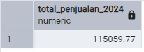
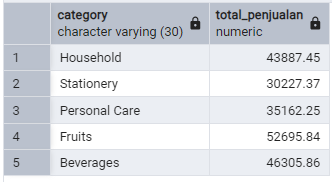

# 📊 SQL Practice Project - Sales Dataset

## 1. Tujuan Project

Proyek ini dibuat untuk mensimulasikan proses analisis data penjualan dengan pendekatan SQL query tingkat lanjut, menggunakan window functions dan Common Table Expressions (CTE). Tujuan utamanya adalah:

- Mendemonstrasikan kemampuan teknis dalam menulis query SQL yang efisien, kompleks, dan dapat di-scale untuk dataset besar.
- Mengasah keterampilan analisis data melalui pembuatan insight yang relevan, seperti peringkat produk terlaris, pertumbuhan penjualan bulanan, dan tren berdasarkan kategori produk.
- Membangun portofolio proyek nyata yang menunjukkan proses kerja end-to-end, mulai dari desain skema database, pembuatan dataset, implementasi query, hingga interpretasi hasil analisis.

Untuk menyelesaikan proyek ini, saya menggunakan kombinasi beberapa tools berikut:

- **PostgreSQL** → Relational Database Management System (RDBMS) yang digunakan untuk menyimpan dan mengelola data. Dipilih karena mendukung window functions, CTE, dan fitur analitik lainnya.
- **pgAdmin** → GUI-based tool untuk PostgreSQL, memudahkan manajemen database, eksekusi query, dan visualisasi data hasil query.
- **CSV Dataset** → Sumber data awal yang di-import ke PostgreSQL. Dataset dibuat secara khusus untuk proyek ini agar relevan dengan kebutuhan analisis.
- **Visual Studio Code (VSCode)** → Digunakan untuk membuat dokumentasi proyek dalam format Markdown, memudahkan penulisan deskripsi, penyisipan gambar ERD, dan syntax highlighting untuk SQL.

Dengan adanya proyek ini, diharapkan pembaca atau perekrut dapat menilai kemampuan saya dalam mengolah, membersihkan, dan menganalisis data menggunakan PostgreSQL.

## 2. Deskripsi Dataset

Dataset ini berisi data penjualan dari 15 produk yang terbagi ke dalam 5 kategori, dijual di 5 wilayah berbeda selama periode 2023–2024.

> **⚠️ Catatan Penting:** Dataset yang digunakan dalam analisis ini adalah data dummy. Nilai harga yang tertera ditujukan murni untuk demonstrasi teknis dalam menjalankan dan menginterpretasikan query SQL, dan mungkin tidak mencerminkan harga pasar yang realistis.

### 2.1 Struktur Tabel

**Tabel `products`**
| Kolom | Tipe Data | Deskripsi |
|--------------|--------------|-----------|
| product_id | SERIAL (PK) | ID unik produk |
| product_name | VARCHAR | Nama produk |
| category | VARCHAR | Kategori produk |
| unit_cost | NUMERIC(10,2)| Harga pokok produk |

**Tabel `regions`**
| Kolom | Tipe Data | Deskripsi |
|-------------|--------------|-----------|
| region_id | SERIAL (PK) | ID unik wilayah |
| region_name | VARCHAR | Nama wilayah |

**Tabel `sales`**
| Kolom | Tipe Data | Deskripsi |
|-------------|--------------|-----------|
| sale_id | SERIAL (PK) | ID unik transaksi |
| product_id | INT (FK) | ID produk |
| region_id | INT (FK) | ID wilayah |
| sale_date | DATE | Tanggal transaksi |
| quantity | INT | Jumlah unit terjual |
| unit_price | NUMERIC(10,2)| Harga per unit |
| total_amount| NUMERIC(10,2)| Total penjualan (`quantity × unit_price`) |

---

**Tabel Relational**


> Tabel Relational dalam proyek ini merepresentasikan hubungan antar tabel utama dalam sistem penjualan dan menjadi acuan utama untuk memahami alur data, relasi antar entitas, dan mempermudah penulisan query SQL yang efisien.

## 3. Praktik & Query

### **3.1 Import & Struktur**

**Tujuan:** Membuat database, tabel, dan mengimpor data dari file CSV.

```sql
-- Contoh membuat tabel products
CREATE TABLE products (
    product_id SERIAL PRIMARY KEY,
    product_name VARCHAR(50),
    category VARCHAR(50),
    unit_cost NUMERIC(10,2)
);

-- Tabel regions
CREATE TABLE regions (
    region_id SERIAL PRIMARY KEY,
    region_name VARCHAR(50)
);

-- Tabel sales
CREATE TABLE sales (
    sale_id SERIAL PRIMARY KEY,
    product_id INT,
    region_id INT,
    sale_date DATE,
    quantity INT,
    unit_price NUMERIC(10,2),
    total_amount NUMERIC(10,2),
    FOREIGN KEY (product_id) REFERENCES products(product_id),
    FOREIGN KEY (region_id) REFERENCES regions(region_id)
);

-- Import Dataset Dari File CSV
copy regions from 'C:\Program Files\PostgreSQL\17\data\sales\regions.csv' delimiter ',' csv header;
copy products from 'C:\Program Files\PostgreSQL\17\data\sales\products.csv' delimiter ',' csv header;
copy sales from 'C:\Program Files\PostgreSQL\17\data\sales\sales.csv' delimiter ',' csv header;
```

**📷 Screenshot hasil cek jumlah baris tiap tabel:**


**Interpretasi:** Data berhasil dimuat dengan total 500 baris pada sales, 15 baris pada products, dan 5 baris pada regions.

### **3.2 Query Agregasi Dasar**

**Query 1:** Total penjualan keseluruhan

```sql
select sum(total_amount) as total_penjualan from sales;
```

**📷 Screenshot hasil:**


**Interpretasi:** Total penjualan seluruh transaksi adalah $208278.77, menunjukkan nilai kumulatif penjualan selama 2 tahun.

**Query 2:** Rata-rata jumlah unit terjual

```sql
select round(avg(quantity), 2) as rata_rata_terjual from sales;
```

**📷 Screenshot hasil:**


**Interpretasi:** Rata-rata unit terjual per transaksi adalah 10.79 ≈ 11 unit.

**Query 3:** Harga unit tertinggi & terendah

```sql
select max(unit_price) as harga_tertinggi, min(unit_price) as harga_terendah from sales;
```

**📷 Screenshot hasil:**


**Interpretasi:** Harga unit tertinggi adalah $72.96, sedangkan terendah adalah $10.59.

### **3.3 Group By & Filter**

**Query 4:** Total penjualan per kategori

```sql
select
    products.category,
    sum(sales.total_amount) as total_penjualan
from
    products
join
    sales
on
    products.product_id = sales.product_id
group by
    products.category;
```

**📷 Screenshot hasil:**


**Interpretasi:** Kategori **Fruits** mencatat penjualan tertinggi, sedangkan **Stationery** terendah.

**Query 5:** Total penjualan per bulan

```sql
select
	extract(year from sale_date) as tahun,
	extract(month from sale_date) as bulan,
	sum(total_amount) as total_penjualan
from
	sales
group by
	tahun,
	bulan
order by
	tahun,
	bulan;
```

**📷 Screenshot hasil:**

 

**Interpretasi:** Data menunjukkan pola penjualan yang sangat volatil atau tidak stabil dari bulan ke bulan, dengan perubahan yang cukup ekstrem hampir setiap kuartalnya.

**Query 6:** Penjualan tahun 2024

```sql
select
    sum(total_amount) as total_penjualan_2024
from
    sales
where
    extract(year from sale_date)='2024';
```

**📷 Screenshot hasil:**



**Interpretasi:** Total penjualan tahun 2024 adalah $115059.77.

**Query 7:** Penjualan produk 'Milk'

```sql
select
    sum(sales.total_amount) as penjualan_milk
from
    products
join
    sales
on
    sales.product_id = products.product_id
where
    products.product_name = 'Milk';
```

**📷 Screenshot hasil:**


**Interpretasi:** Penjualan produk Milk dari keseluruhan dataset transaksi (2023-2024) senilai $11751.13

**Query 8:** Penjualan Region 3/West

> Saya telah mengubah 5 nilai kolom region_name menjadi North, West, East, South, Central, Lengkap nya cek file script-query.sql [di sini](sql/script-query.sql)

```sql
select
    sum(sales.total_amount)
from
    regions
join
    sales
on
    regions.region_id = sales.region_id
where
    regions.region_name = 'West';
```

**📷 Screenshot hasil:**


**Interpretasi:** Total penjualan yang dilakukan di Region West senilai $48043.15

### **3.4 Analisis Lanjutan — Window Functions**

**Query 9:** Penggunaan ROW_NUMBER() berdasarkan tanggal

```sql
select
    product_id,
    region_id,
    sale_date,
    quantity,
    unit_price,
    total_amount,
	row_number() over(order by sale_date DESC) as urutan
from
    sales;
```

**📷 Screenshot hasil:**


**Interpretasi:** Dengan urutan ini, kita dapat dengan mudah mengidentifikasi transaksi terbaru atau membuat paging data transaksi. Berguna untuk analisis tren terkini atau penelusuran riwayat penjualan.

**Query 10:** Top 2 produk terlaris per kategori (RANK())

```sql
WITH ProductSales AS (
    SELECT
        p.category,
        p.product_name,
        SUM(s.quantity) AS total_quantity
    FROM
        sales s
    JOIN
        products p ON s.product_id = p.product_id
    GROUP BY
        p.category,
        p.product_name
),
RankedSales AS (
    SELECT
        category,
        product_name,
        total_quantity,
        RANK() OVER (PARTITION BY category ORDER BY total_quantity DESC) AS sales_rank
    FROM
        ProductSales
)
SELECT
    category,
    product_name,
    total_quantity,
    sales_rank
FROM
    RankedSales
WHERE
    sales_rank <= 2;
```

**📷 Screenshot hasil:**


**Interpretasi:** Hasilnya membantu dalam pengambilan keputusan bisnis seperti strategi stok, promosi khusus, atau product bundling berdasarkan performa produk di tiap kategori.

**Query 11:** Pertumbuhan month-over-month (LAG())

```sql
WITH MonthlySales AS (
    SELECT
        EXTRACT(YEAR FROM sale_date) AS tahun,
        EXTRACT(MONTH FROM sale_date) AS bulan,
        SUM(total_amount) AS total_penjualan
    FROM
        sales
    GROUP BY
        tahun, bulan
)
SELECT
    tahun,
    bulan,
    total_penjualan,
    LAG(total_penjualan, 1, 0) OVER (ORDER BY tahun, bulan) AS penjualan_bulan_lalu,
	total_penjualan - LAG(total_penjualan, 1, 0) OVER (ORDER BY tahun, bulan) AS selisih_penjualan
FROM
    MonthlySales
ORDER BY
    tahun, bulan;
```

**📷 Screenshot hasil:**


**Interpretasi:** Analisis ini mengungkap tren pertumbuhan atau penurunan penjualan dari bulan ke bulan. Dapat digunakan untuk evaluasi strategi penjualan atau mengantisipasi musim penjualan.

### **3.5 Analisis Lanjutan — CTE**

**Query 12:** CTE Pipeline 1 — Data mentah → Data bersih → agregasi kategori

```sql
WITH raw_data AS (
	select *
	from sales
	where quantity > 0
),
clean_data AS (
	select
		raw_data.*,
		products.product_name,
		category
	from raw_data
	join products
	on raw_data.product_id = products.product_id
)
select
	category,
	sum(total_amount) as total_penjualan
from clean_data
group by category;
```

**📷 Screenshot hasil:**



**Interpretasi:** Pipeline ini memastikan hanya data yang valid digunakan, sekaligus memberi gambaran kategori mana yang menghasilkan penjualan terbesar.

**Query 13:** CTE Pipeline 2 — Pertumbuhan positif MoM

```sql
WITH monthly_sales AS (
	select
		extract(year from sale_date) AS tahun,
		extract(month from sale_date) AS bulan,
		sum(total_amount) as total_penjualan
	from sales
	group by tahun, bulan
),
monthly_growth AS (
	select
		monthly_sales.*,
		lag(total_penjualan, 1, 0) over(order by tahun, bulan) as bulan_sebelumnya,
		total_penjualan - lag(total_penjualan, 1, 0) over(order by tahun, bulan) as MoM
	from monthly_sales
)
select *
from monthly_growth
where MoM > 0
order by tahun, bulan;
```

**📷 Screenshot hasil:**


**Interpretasi:** Pendekatan ini membantu fokus pada periode-periode di mana bisnis mengalami perkembangan signifikan, sehingga strategi dari bulan tersebut dapat direplikasi.
